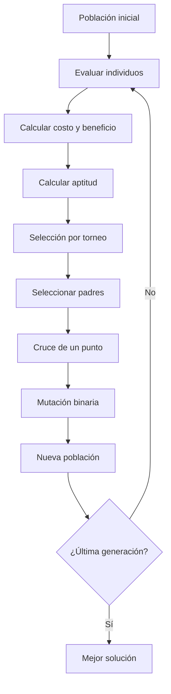
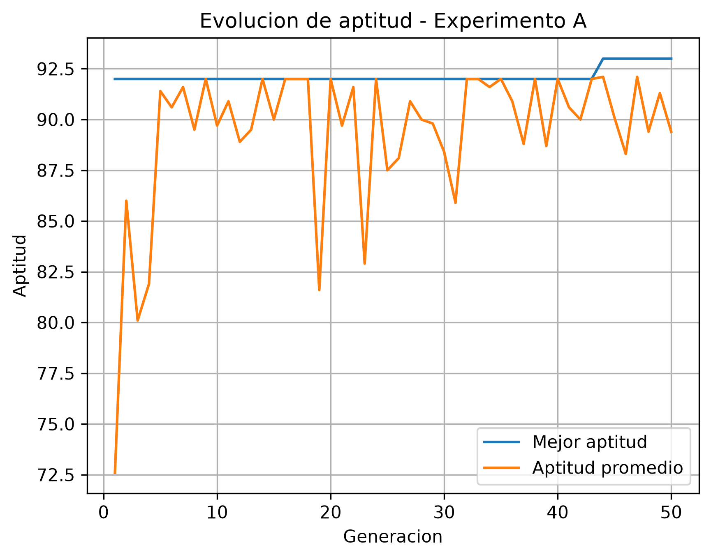
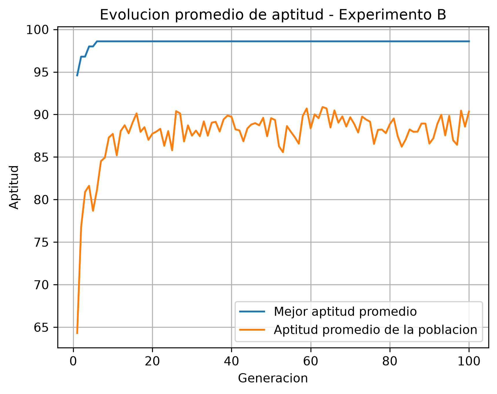
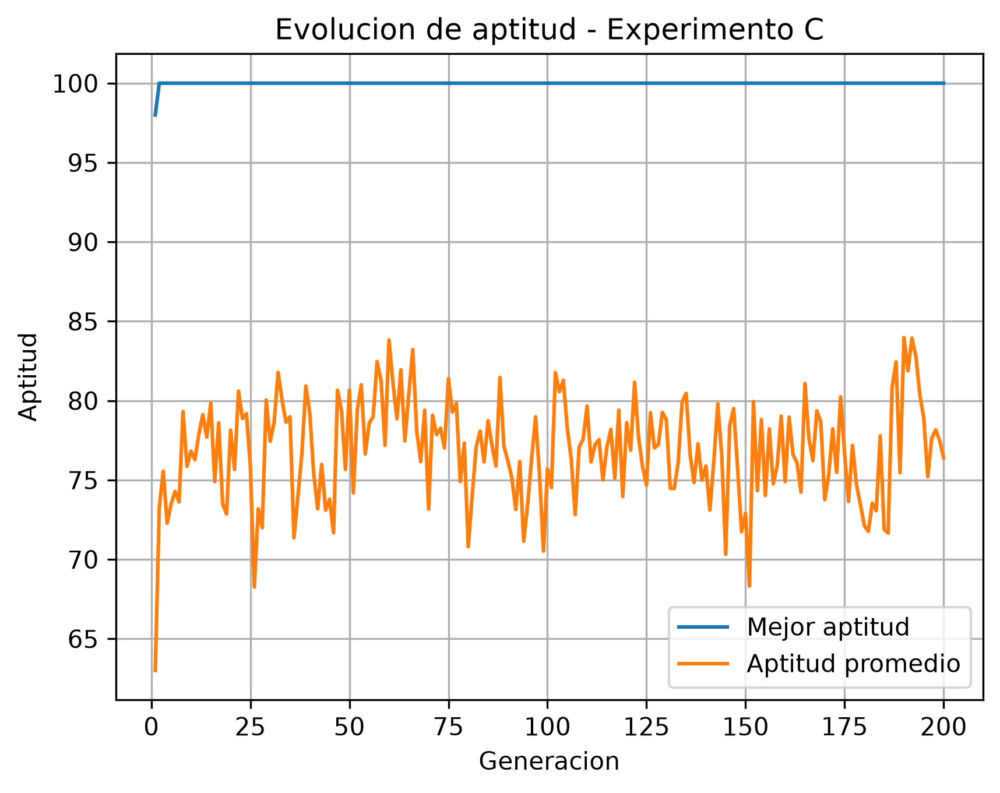
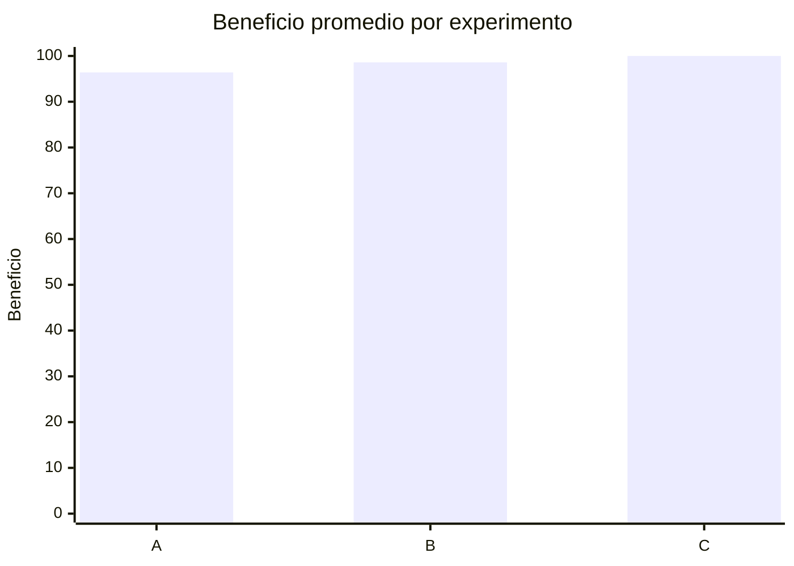
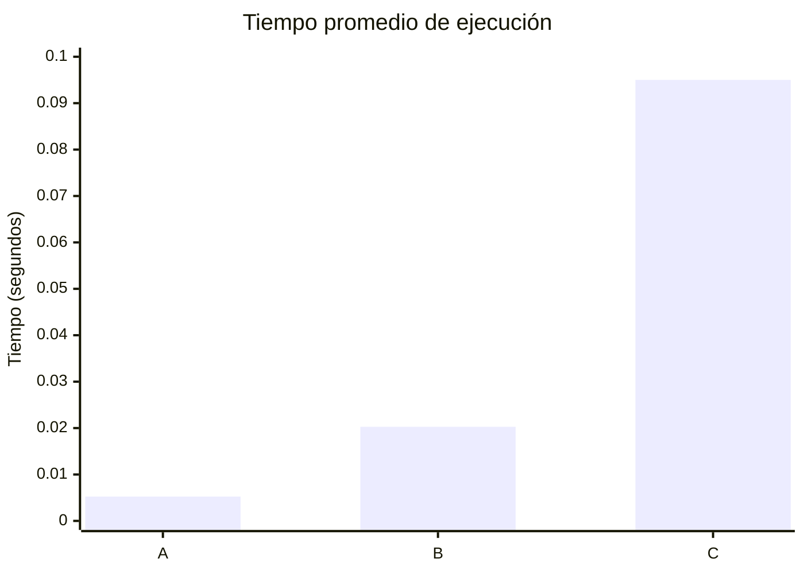

# 🧬 Algoritmo Genético — Selección Óptima de Proyectos

## 📌 Descripción del proyecto

Este repositorio contiene el desarrollo de un taller académico sobre **algoritmos genéticos**, aplicado a un problema de selección óptima de proyectos de innovación.

El problema consiste en seleccionar un conjunto de proyectos buscando **maximizar el beneficio total**, sin superar un presupuesto máximo de **50 unidades monetarias**.

El proyecto se desarrolla progresivamente en cinco puntos:

1. **Formulación matemática del problema.**
2. **Generación de la población inicial y función de aptitud.**
3. **Implementación de operadores genéticos.**
4. **Construcción del algoritmo genético completo.**
5. **Realización de experimentos y análisis de resultados.**

De esta manera, el repositorio muestra el proceso completo desde la definición matemática del problema hasta la implementación, ejecución y análisis experimental de un algoritmo genético.

---

# 🎯 Objetivo

El objetivo principal es comprender e implementar un **algoritmo genético** capaz de encontrar buenas soluciones para un problema de optimización con restricciones.

Durante el desarrollo se busca:

* Representar soluciones mediante cromosomas binarios.
* Crear una población inicial de individuos.
* Calcular el costo y beneficio de cada solución.
* Implementar una función de aptitud.
* Penalizar soluciones que superen el presupuesto.
* Aplicar selección por torneo.
* Implementar cruce de un punto.
* Implementar mutación binaria.
* Construir el algoritmo genético completo.
* Evaluar el comportamiento del algoritmo mediante diferentes configuraciones.
* Analizar los resultados obtenidos en varias ejecuciones.

---

# 🧠 ¿Qué es un algoritmo genético?

Un algoritmo genético es una técnica de optimización inspirada en algunos principios de la evolución biológica.

En lugar de intentar encontrar directamente una única solución, el algoritmo trabaja con una **población de posibles soluciones**.

Cada solución se representa mediante un **individuo**, cuyo cromosoma contiene los genes que representan sus decisiones.

Durante cada generación, los individuos son evaluados y se utilizan operadores genéticos para generar nuevas soluciones.

Los principales procesos son:

* **Selección:** elegir individuos que serán utilizados como padres.
* **Cruce:** combinar información genética de dos padres.
* **Mutación:** modificar aleatoriamente algunos genes.
* **Evaluación:** determinar qué tan buena es cada solución.

El proceso se repite durante varias generaciones buscando soluciones con una mejor aptitud.

---

# 🔄 Flujo general del algoritmo

El funcionamiento general implementado en el proyecto puede representarse mediante el siguiente diagrama:



Este flujo representa la evolución de la población desde la generación inicial hasta la obtención de la mejor solución encontrada.

---

# 📋 Formulación del problema

El problema trabaja con **10 proyectos de innovación**.

Cada proyecto tiene asociado:

* Un costo.
* Un beneficio.

La información utilizada es:

| Proyecto | Costo | Beneficio |
| :------: | ----: | --------: |
|    P1    |    12 |        24 |
|    P2    |     7 |        13 |
|    P3    |    11 |        23 |
|    P4    |     8 |        15 |
|    P5    |     9 |        16 |
|    P6    |    14 |        28 |
|    P7    |     6 |        11 |
|    P8    |    10 |        19 |
|    P9    |     5 |         9 |
|    P10   |    13 |        25 |

### 💰 Presupuesto máximo

El presupuesto disponible es:

```text
50 unidades monetarias
```

Una solución es válida cuando:

```text
Costo total ≤ 50
```

---

# 🧬 Representación del cromosoma

Cada proyecto se representa mediante un gen binario.

```text
1 → Proyecto seleccionado
0 → Proyecto no seleccionado
```

Como existen 10 proyectos, cada individuo tiene un cromosoma de 10 genes.

Por ejemplo:

```text
0111001011
```

se interpreta como:

```text
P1  P2  P3  P4  P5  P6  P7  P8  P9  P10
 0   1   1   1   0   0   1   0   1    1
```

Por lo tanto, los proyectos seleccionados son:

```text
P2, P3, P4, P7, P9 y P10
```

Su costo es:

```text
7 + 11 + 8 + 6 + 5 + 13 = 50
```

y su beneficio:

```text
13 + 23 + 15 + 11 + 9 + 25 = 96
```

Como el costo es exactamente igual al presupuesto, la solución es válida.

---

# 🔢 Espacio de búsqueda

Cada uno de los 10 genes puede tomar dos valores:

```text
0 o 1
```

Por lo tanto, el número de combinaciones posibles es:

```text
2¹⁰ = 1024
```

Esto significa que existen **1024 soluciones posibles** para el problema.

El algoritmo genético busca explorar este espacio de soluciones sin tener que evaluar necesariamente todas las combinaciones.

---

# 🧩 Desarrollo del proyecto

## 1️⃣ Punto 1 — Formulación del problema

El primer punto establece la formulación matemática del problema.

Se define una variable de decisión:

```text
xᵢ ∈ {0,1}
```

donde:

* `xᵢ = 1` → el proyecto se selecciona.
* `xᵢ = 0` → el proyecto no se selecciona.

### Función objetivo

El objetivo es maximizar el beneficio:

```text
Maximizar:

B(X) = Σ bᵢxᵢ
```

donde `bᵢ` representa el beneficio de cada proyecto.

### Restricción

El costo total debe cumplir:

```text
C(X) = Σ cᵢxᵢ ≤ 50
```

### Ejemplo

Se analiza el individuo:

```text
(1,0,1,1,0,0,1,0,1,0)
```

que selecciona:

```text
P1, P3, P4, P7 y P9
```

Costo:

```text
12 + 11 + 8 + 6 + 5 = 42
```

Beneficio:

```text
24 + 23 + 15 + 11 + 9 = 82
```

Como `42 ≤ 50`, la solución es válida.

---

## 2️⃣ Punto 2 — Población inicial y función de aptitud

En el segundo punto se pasa de la formulación matemática a la generación de soluciones.

El programa genera una población inicial de:

```text
N = 20 individuos
```

Cada individuo tiene un cromosoma binario de 10 genes.

Para cada individuo se calcula:

* Cromosoma.
* Proyectos seleccionados.
* Costo total.
* Beneficio total.
* Aptitud.
* Validez de la solución.

### Función de aptitud

Las soluciones que cumplen el presupuesto utilizan directamente su beneficio:

```text
fitness(X) = B(X)
```

Para las soluciones que superan el presupuesto se utiliza una penalización:

```text
fitness(X) = B(X) − λ(C(X) − 50)
```

El valor utilizado es:

```text
λ = 5
```

Por ejemplo, una solución con:

```text
Beneficio = 98
Costo = 51
```

tiene un exceso de:

```text
51 - 50 = 1
```

Por lo tanto:

```text
fitness = 98 - 5(1)
fitness = 93
```

### Resultados de la población inicial

En la ejecución documentada:

* **20 individuos** fueron generados.
* **13 de 20** soluciones fueron válidas.
* La mejor solución válida obtuvo **96 de beneficio**.
* La aptitud promedio de la población fue **65.95**.

### Análisis de λ

El proyecto también analiza diferentes valores de λ.

|  λ | Aptitud de solución inválida | Comparación  |
| -: | ---------------------------: | ------------ |
|  0 |                           98 | Supera 96    |
|  1 |                           97 | Supera 96    |
|  2 |                           96 | Iguala 96    |
|  3 |                           95 | Menor que 96 |
|  5 |                           93 | Menor que 96 |
| 10 |                           88 | Menor que 96 |
| 20 |                           78 | Menor que 96 |
| 50 |                           48 | Menor que 96 |

El valor utilizado finalmente es:

```text
λ = 5
```

---

## 3️⃣ Punto 3 — Operadores genéticos

En el tercer punto se implementan los operadores necesarios para producir nuevas soluciones.

Se utilizan tres operadores principales:

### 🔹 Selección por torneo

Se utiliza un torneo de tamaño:

```text
3 individuos
```

Se seleccionan aleatoriamente tres individuos y se escoge como ganador el que tenga mayor aptitud.

El ganador se utiliza como padre.

---

### 🔹 Cruce de un punto

El cruce combina dos cromosomas.

Por ejemplo:

```text
Padre 1 = 1011 | 101010
Padre 2 = 0111 | 001011
```

Después del cruce:

```text
Hijo 1 = 1011 | 001011
Hijo 2 = 0111 | 101010
```

El punto de corte se selecciona aleatoriamente.

---

### 🔹 Mutación binaria

La probabilidad de mutación utilizada es:

```text
pm = 0.05
```

Es decir, existe una probabilidad del 5 % de que cada gen sea seleccionado para mutar.

Cuando ocurre una mutación:

```text
0 → 1
1 → 0
```

La mutación permite introducir diversidad y explorar nuevas soluciones.

---

# ⚙️ Punto 4 — Algoritmo genético completo

En el cuarto punto se integran los elementos desarrollados anteriormente para construir el algoritmo genético completo.

La configuración utilizada es:

| Parámetro                | Valor |
| ------------------------ | ----: |
| Población                |    20 |
| Generaciones             |   100 |
| Probabilidad de cruce    |  0.80 |
| Probabilidad de mutación |  0.05 |
| Tamaño del torneo        |     3 |
| Elitismo                 |     1 |
| λ                        |     5 |

El elitismo permite conservar un individuo de alto desempeño entre generaciones.

El algoritmo sigue el siguiente proceso:

```text
1. Generar población
2. Evaluar población
3. Identificar mejor individuo
4. Seleccionar padres
5. Realizar cruce
6. Aplicar mutación
7. Crear nueva generación
8. Conservar el individuo élite
9. Repetir
10. Obtener la mejor solución
```

Durante la ejecución del Punto 4, la mejor solución registrada alcanzó:

```text
Beneficio = 97
Costo = 50
```

con el cromosoma:

```text
1011100100
```

---

# 📊 Punto 5 — Experimentos

El quinto punto analiza el comportamiento del algoritmo utilizando diferentes configuraciones.

Se realizaron tres experimentos principales:

| Experimento | Población | Generaciones | Mutación |
| :---------: | --------: | -----------: | -------: |
|      A      |        10 |           50 |     0.01 |
|      B      |        20 |          100 |     0.05 |
|      C      |        50 |          200 |     0.10 |

Cada experimento cuenta con **5 corridas independientes**.

Se registraron variables como:

* Beneficio obtenido.
* Costo de la mejor solución.
* Proyectos seleccionados.
* Generación donde apareció la mejor solución.
* Tiempo de ejecución.
* Aptitud promedio final.
* Diversidad final.
* Diversidad promedio.

---

# 📈 Resultados de los experimentos

| Experimento | Beneficio promedio | Mejor beneficio | Costo mejor solución | Generación promedio de mejor solución | Tiempo promedio |
| :---------: | -----------------: | --------------: | -------------------: | ------------------------------------: | --------------: |
|      A      |              96.40 |             100 |                   50 |                                 12.00 |      0.005241 s |
|      B      |              98.60 |             100 |                   50 |                                  3.20 |      0.020269 s |
|      C      |             100.00 |             100 |                   50 |                                 36.40 |      0.095013 s |

Las tres configuraciones encontraron una solución con:

```text
Beneficio = 100
Costo = 50
```

La solución corresponde a los proyectos:

```text
P1, P3, P6 y P10
```

Su cálculo es:

```text
Costo:
12 + 11 + 14 + 13 = 50

Beneficio:
24 + 23 + 28 + 25 = 100
```

Por lo tanto, esta solución cumple exactamente el presupuesto y alcanza un beneficio de 100.

---

# 📊 Gráficas de los experimentos

El repositorio incluye las gráficas generadas durante el Punto 5.

### Experimento A

Configuración:

```text
Población = 10
Generaciones = 50
Mutación = 0.01
```



---

### Experimento B

Configuración:

```text
Población = 20
Generaciones = 100
Mutación = 0.05
```



---

### Experimento C

Configuración:

```text
Población = 50
Generaciones = 200
Mutación = 0.10
```



Estas gráficas permiten observar visualmente el comportamiento del algoritmo durante las diferentes configuraciones experimentales.

---

# 🔍 Análisis de los experimentos

Los resultados muestran que las tres configuraciones consiguieron encontrar una solución con beneficio máximo registrado de **100** y costo **50**.

Sin embargo, las configuraciones presentan diferencias en otros aspectos.

### Experimento A

Utiliza la población y número de generaciones más pequeños.

```text
Población: 10
Generaciones: 50
Mutación: 0.01
```

El beneficio promedio fue:

```text
96.40
```

y el tiempo promedio de ejecución fue aproximadamente:

```text
0.005241 segundos
```

La solución de beneficio 100 apareció en algunas de las corridas, pero no en todas.

---

### Experimento B

Utiliza:

```text
Población: 20
Generaciones: 100
Mutación: 0.05
```

Obtuvo un beneficio promedio de:

```text
98.60
```

y encontró el mejor beneficio de 100.

La generación promedio en la que apareció la mejor solución fue:

```text
3.20
```

El tiempo promedio fue:

```text
0.020269 segundos
```

---

### Experimento C

Utiliza la población y número de generaciones más grandes:

```text
Población: 50
Generaciones: 200
Mutación: 0.10
```

El beneficio promedio fue:

```text
100.00
```

y todas las corridas registraron una solución con beneficio 100.

El tiempo promedio de ejecución aumentó a:

```text
0.095013 segundos
```

También se obtuvo una diversidad promedio considerablemente mayor:

```text
41.43
```

Esto permite observar cómo modificar el tamaño de población, número de generaciones y tasa de mutación cambia el comportamiento de la búsqueda.

---

# 🧪 Comparación visual

El siguiente gráfico resume el beneficio promedio obtenido en cada configuración:



También se puede comparar el tiempo promedio:



---

# 📂 Estructura del repositorio

```text
ALGORITMO_GENETICO/
│
├── Punto1.md
│
├── punto2/
│   ├── README.md
│   ├── ejercicios_punto2.md
│   ├── punto2.py
│   ├── resultados_punto2.txt
│   ├── resultados_punto2_lambda.csv
│   └── resultados_punto2_poblacion.csv
│
├── Punto3/
│   ├── Readme.md
│   ├── punto3_operadores_geneticos.py
│   └── resultados_punto3.txt
│
├── punto4/
│   ├── punto4.py
│   └── resultados_punto4.txt
│
└── punto5/
    ├── punto5.py
    ├── graficas/
    │   ├── experimento_A.png
    │   ├── experimento_B.png
    │   └── experimento_C.png
    │
    └── resultados/
        ├── corridas_iniciales.txt
        ├── experimentos.txt
        ├── tabla_corridas_iniciales.csv
        ├── tabla_experimentos_detalle.csv
        └── tabla_resumen_experimentos.csv
```

---

# 🛠️ Tecnologías utilizadas

El proyecto fue desarrollado principalmente utilizando:

* **Python 3**
* **Git**
* **GitHub**
* **Markdown**
* **CSV** para almacenamiento de resultados.
* **Archivos TXT** para registrar ejecuciones.
* **Gráficas PNG** para visualizar los experimentos.

El código utiliza principalmente funcionalidades de la biblioteca estándar de Python.

---

# ⚙️ Instalación

Clonar el repositorio:

```bash
git clone https://github.com/linacastaneda/ALGORITMO_GENETICO.git
```

Ingresar a la carpeta:

```bash
cd ALGORITMO_GENETICO
```

Verificar que Python esté instalado:

```bash
python --version
```

---

# ▶️ Ejecución

Cada punto cuenta con su propio archivo de ejecución.

### Punto 2

```bash
python -X utf8 "punto2/punto2.py"
```

### Punto 3

```bash
python -X utf8 "Punto3/punto3_operadores_geneticos.py"
```

### Punto 4

```bash
python -X utf8 "punto4/punto4.py"
```

### Punto 5

```bash
python -X utf8 "punto5/punto5.py"
```

Los programas generan o actualizan los archivos de resultados correspondientes.

---

# 📊 Archivos de resultados

Los resultados del proyecto se almacenan en diferentes formatos.

### CSV

Los archivos CSV permiten consultar los datos de las poblaciones y experimentos en forma tabular.

Por ejemplo:

```text
resultados_punto2_poblacion.csv
resultados_punto2_lambda.csv
tabla_corridas_iniciales.csv
tabla_experimentos_detalle.csv
tabla_resumen_experimentos.csv
```

### TXT

Los archivos TXT almacenan resultados detallados de las ejecuciones:

```text
resultados_punto2.txt
resultados_punto3.txt
resultados_punto4.txt
corridas_iniciales.txt
experimentos.txt
```

### PNG

El Punto 5 contiene las gráficas:

```text
experimento_A.png
experimento_B.png
experimento_C.png
```

---

# 📚 Conceptos principales

| Concepto     | Descripción                                             |
| ------------ | ------------------------------------------------------- |
| Individuo    | Una posible solución al problema                        |
| Cromosoma    | Representación de un individuo                          |
| Gen          | Cada decisión binaria sobre un proyecto                 |
| Población    | Conjunto de individuos                                  |
| Aptitud      | Medida utilizada para evaluar una solución              |
| Selección    | Proceso de elección de padres                           |
| Torneo       | Método utilizado para realizar la selección             |
| Cruce        | Combinación de dos padres                               |
| Mutación     | Cambio aleatorio de genes                               |
| Generación   | Una iteración del algoritmo                             |
| Elitismo     | Conservación de una solución de alto desempeño          |
| Penalización | Reducción de aptitud cuando se incumple una restricción |
| Diversidad   | Medida de variación existente en la población           |

---

# 📝 Conclusiones

El desarrollo del proyecto permitió implementar progresivamente un algoritmo genético para resolver un problema de selección de proyectos con una restricción presupuestal.

En el primer punto se formuló matemáticamente el problema y se estableció la representación binaria de los individuos.

En el segundo punto se generó una población inicial y se implementó una función de aptitud que incorpora una penalización mediante el parámetro λ para las soluciones que superan el presupuesto.

En el tercer punto se implementaron los principales operadores genéticos: selección por torneo, cruce de un punto y mutación binaria.

Posteriormente, en el cuarto punto se integraron estos componentes en un algoritmo genético completo con múltiples generaciones y elitismo.

Finalmente, el quinto punto permitió experimentar con diferentes tamaños de población, número de generaciones y probabilidades de mutación. En las pruebas realizadas, las configuraciones evaluadas encontraron soluciones con **beneficio 100 y costo 50**, correspondientes a la selección de los proyectos **P1, P3, P6 y P10**.

El proyecto permite observar cómo los algoritmos genéticos pueden utilizarse para explorar espacios de búsqueda y encontrar soluciones factibles y de alto beneficio mediante un proceso evolutivo.

---

# 👥 Autores

Proyecto desarrollado como actividad académica sobre **algoritmos genéticos y técnicas de optimización**.

**Repositorio:**
https://github.com/linacastaneda/ALGORITMO_GENETICO

---

# 📖 Documentación adicional

Para consultar el desarrollo detallado de cada parte del proyecto, se pueden revisar los siguientes archivos:

* [Punto 1 — Formulación](Punto1.md)
* [Punto 2 — Población y función de aptitud](punto2/README.md)
* [Punto 3 — Operadores genéticos](Punto3/Readme.md)
* [Punto 4 — Algoritmo genético completo](punto4/)
* [Punto 5 — Experimentos y resultados](punto5/)
